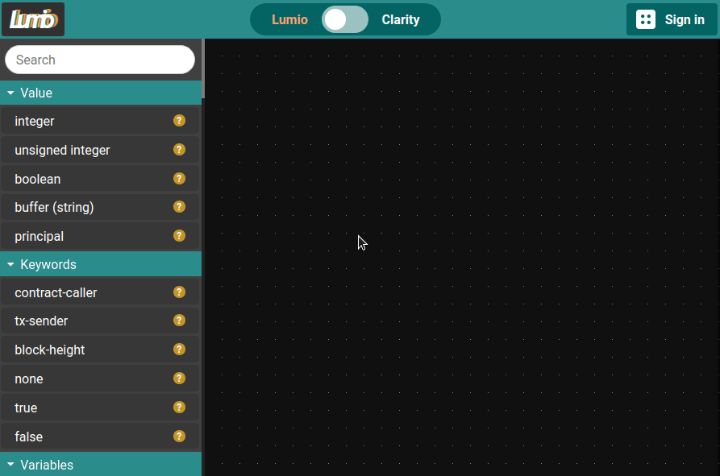

# Lumio

[Lumio](https://lumio.app) is a reactive visual programming IDE for [Clarity](https://clarity-lang.org/). It allows you to program Clarity smart contracts using drag and drop. It is reactive in the sense that it keeps track of custom definitions and updates those in place in real time.

You can try it out on https://lumio.app. 

It is still possible to generate invalid code with Lumio. It currently does not insert placeholders when placing custom functions, for example.

This is a submission for the Clarity tooling hackathon.

## Install

1. Clone this repository.
2. `cd lumio`.
3. `npm install`.
4. `npm run dev` to run the [development server](http://localhost:5000) or `npm run build` to build.

You can generate docs using `npm run jsdoc` (install jsdoc using `npm install -g jsdoc`).

## To-dos:

- Blockstack login to save and load your smart contracts.
- Add custom symbol support to the validator and transpiler.
- More comprehensive validation.
- Interactive tutorial.
